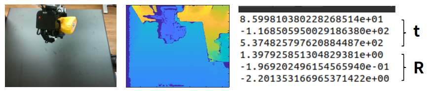

# Robot-based Object Pose Auto-annotation System for Dexterous Manipulation
(presented at ICTC 2023)
This 6d object pose annotation system utilizes robots to automatically annotate the poses of objects based on robot kinematics. \
Applying coordinate transformations among the robot, camera, and object enables automatic and precise object pose measurement.

## Hardware composition
- Robot manipulator \
Ufactory Xarm6 (6 dof, payload 5kg)
- Robot hand \
Allegro hand (16 dof)
- Camera \
Intel RealSense D435i


## Python requirements
- OpenCV >= 2.0

***
## Dataset description
### 6d pose Unit
We provide camera-to-object pose in [mm] and [rad] for translation and rotation respectively. Rotation is represented in a rotation vector. \
$`[\mathbf{{t}}^{T},\mathbf{{R}}^{T}]`$

### Structure
in 'data' folder
```
├── Object01
│   ├── Coordinate.png
│   ├── Grasp01
│   │   ├── 000000-bbog_gt.png
│   │   ├── 000000-color.png
│   │   ├── 000000-depth.png
│   │   ├── 000000-pose_gt.txt
│   │   ├── 000001-color.png
│   │   ├── 000001-depth.png
│   │   ├── 000001-pose.txt
│   │   ├── 000002-color.png
│   │   ├── 000002-depth.png
│   │   ├── 000002-pose.txt
│   │   ├── ...
│   ├── Grasp02
│   ├── ...
├── Object02
```
</img>
***
## Visualization
Code for projection of annotated pose. \
    - Input parameter: object name, grasp_id, frame_num \
    - Input data: RGB image, 6d pose, camera intrinsic parameter \
    - Output data: 3D bbox image

```bash
!python3 visualize.py --object coffeecan --grasp_id 01 --frame_num 000001 --MARKER False --SAVE True
```
If the save flag is true, bbox image will be saved in file name as '{path}/O{object_id}_G{grasp_id}_{frame_id}-bbox.png'.

### Visualization example
This is an example of coffee can and mustard 3d bounding box

</img>

## Contact
The code of this repository was implemented by Sunme Park. \
For questions, please contact pishp00200@keti.re.kr.
